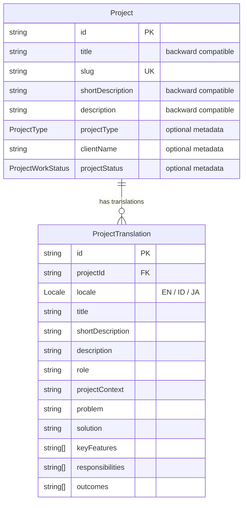
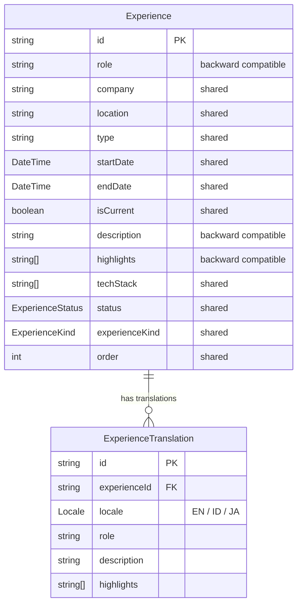

# Database Documentation

## Fungsi Folder
Folder ini berisi dokumentasi teknis untuk model data, skema database, dan rencana penyimpanan jangka panjang.

## Status Database Saat Ini
- **Development Database**: PostgreSQL lokal via Docker Compose.
- **Production Database**: Neon PostgreSQL managed database aktif pada branch `production`.
- **Integrasi**: Database sudah terintegrasi penuh dan menjadi sumber data utama website publik di production dengan ORM Prisma.

## Kapan Update Dokumen Ini
Dokumen ini harus diupdate jika terjadi perubahan pada data model, skema database, atau migrasi data saat backend mulai hidup.

## Hubungan dengan Feature Batch
Berkaitan erat dengan **F07** (Backend API), **F08** (Auth), dan **F09** (Admin CMS). Rencana skema data untuk sistem tersebut akan dicatat di sini.

## Area Database yang Dicatat
- data model
- schema
- migration plan
- storage strategy
- seed/mock data (jika ada)

## Panduan Menjalankan PostgreSQL Lokal (Development)
Untuk menjalankan backend secara lokal, Anda membutuhkan database PostgreSQL yang aktif. 
Kami telah menyediakan opsi menggunakan Docker Compose agar lebih mudah.

1. **Jalankan PostgreSQL via Docker**:
   Masuk ke folder `server/` dan jalankan:
   ```bash
   docker-compose up -d
   ```
   *Ini akan menjalankan container `pw_postgres` di port `5433` pada host, sesuai dengan konfigurasi `.env` default.*

2. **Validasi dan Persiapan Prisma (Development)**:
   Setelah database lokal hidup, inisialisasi skema dan isi data awal:
   - Generate client: `npm run prisma:generate`
   - Development migration command: `npx prisma migrate dev` (atau script lokal `npm run prisma:migrate`)
   - Development seed command: `npm run seed`

## Validasi Database Minimal
- Perubahan schema harus selalu dicatat.
- Migration tidak boleh dibuat tanpa instruksi eksplisit.
- Tidak boleh menyimpan data sensitif.
- Selalu pastikan database lokal hidup (`docker-compose ps`) sebelum menjalankan `npm run dev`.

## Production Deployment Strategy & Policies
1. **Production Managed Database**: Neon PostgreSQL managed database aktif pada branch `production`. Docker lokal hanya digunakan untuk development.
2. **Production Migration Command**: Gunakan perintah `npx prisma migrate deploy` di production untuk menerapkan skema database tanpa menghapus data interaktif.
3. **Seed Policy**: Menjalankan seed (`npm run seed`) hanya diperuntukkan untuk environment lokal (development) atau inisialisasi awal (initial deployment) yang benar-benar disengaja.
4. **Danger Zone (Peringatan Keras)**: **JANGAN** pernah jalankan script seed di production setelah website hidup dan terisi data riil dari CMS, karena operasi `deleteMany` di dalam seed script akan menghapus seluruh data production Anda!
5. **Safe Synchronization Scripts**:
   - Untuk melakukan sinkronisasi data publik terbaru ke Neon database secara aman tanpa menghapus live data CMS (misalnya, data user atau data proyek custom), gunakan script sinkronisasi yang tersedia di `server/scripts/`:
     - Targeted BNSP Credential Sync: `npm run sync:credential:bnsp` (menargetkan `bnsp-web-node-react`)
     - Full Public Content Sync: `npm run sync:public-content`
   - Kedua script di atas secara default berjalan dalam mode **Dry-Run (Read-Only)** untuk keamanan.
   - Untuk mengaplikasikan perubahan secara riil ke database target, set environment variable manual:
     - `APPLY_CREDENTIAL_SYNC=true npm run sync:credential:bnsp`
     - `APPLY_PUBLIC_CONTENT_SYNC=true npm run sync:public-content`


## Catatan Penting
- Database tidak boleh dikerjakan bersamaan dengan frontend UI besar tanpa scope yang jelas.

## Multilingual Project Schema (Batch F03H)
Sebagai fondasi dukungan konten multibahasa (multilingual) pada Project Portfolio System, skema basis data telah diperbarui untuk mendukung relasi one-to-many antara model `Project` dengan model `ProjectTranslation`.

### Data Model & Relationship


- **Backward Compatibility**: Field `title`, `shortDescription`, dan `description` tetap dipertahankan pada model `Project` utama agar endpoint API `/api/projects` lama dan visualisasi frontend tidak rusak.
- **Enums**:
  - `Locale`: `EN` (English), `ID` (Indonesian), `JA` (Japanese).
  - `ProjectType`: `CLIENT_WORK`, `FREELANCE`, `CASE_STUDY`, `LEARNING_PROJECT`, `INTERNAL`.
  - `ProjectWorkStatus`: `COMPLETED`, `IN_PROGRESS`, `MAINTENANCE`, `ARCHIVED`.
- **Constraint**: Kombinasi `projectId` dan `locale` bersifat unik (`@@unique([projectId, locale])`) untuk menjamin hanya ada satu terjemahan per bahasa untuk setiap proyek.

## Multilingual Experience Schema (Batch F03S-SPEC Planned)
Sebagai bagian dari rencana perluasan fitur multilingual CMS, model `Experience` akan diintegrasikan dengan model `ExperienceTranslation` relasional.

### Data Model & Relationship (Planned)


- **Backward Compatibility**: Kolom `role`, `description`, dan `highlights` di tabel `Experience` utama tetap dipertahankan sebagai fallback data warisan (legacy) jika terjemahan relasional tidak tersedia.
- **Translatable Fields**: `role` (String), `description` (String), dan `highlights` (String[]).
- **Shared Fields**: `company`, `location`, `type`, `startDate`, `endDate`, `isCurrent`, `techStack`, `status`, `experienceKind`, dan `order`.
- **Constraint**: Kombinasi `experienceId` dan `locale` diatur unik (`@@unique([experienceId, locale])`) dengan indeks khusus pada kolom `locale` untuk performa kueri.
