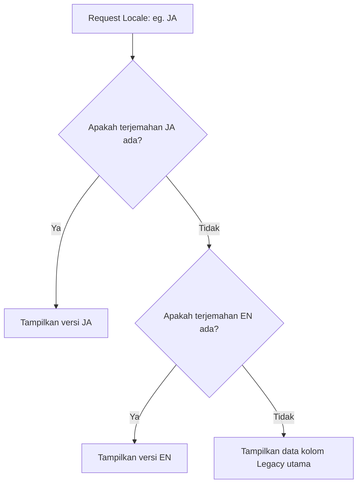

# Batch F03 — Project Portfolio System

## Feature Summary
Sistem portfolio, kategori, card, modal, dan link tile.

## Status
Completed

## Story
Mencakup sistem portfolio, kategori proyek, project card, modal detail, dan link tile. Merupakan ruang pamernya karya user.

## Current State
- UI berjalan dengan baik.
- Modal memunculkan detail yang relevan.
- Link tile diperbarui dengan link aman.
- Curation data proyek dilakukan dengan berorientasi pada kebutuhan rekrutmen HRD Full Stack Developer (Batch F03D).
- Restrukturisasi database Project untuk fondasi multibahasa berhasil diterapkan (Batch F03H) dengan model translations relasional.

### F03-CP Checkpoint Summary
Setelah rangkaian sub-batch database relasional dan lokalisasi selesai (F03H–F03L), Project Portfolio System telah diperkuat dengan kemampuan studi kasus multibahasa:
- **Multilingual Database Foundation** (`F03H`): Skema Prisma terstruktur dengan model `ProjectTranslation` relasional untuk mendukung locale `EN`, `ID`, dan `JA` tanpa merusak kompatibilitas field legacy.
- **Public API Locale Support** (`F03I`): Endpoint publik (`/api/projects` & `/api/projects/:slug`) mendukung query parameter `?locale=` dengan fallback otomatis ke `EN` dan mengembalikan respons format flat/non-breaking.
- **Admin EN Translation Sync** (`F03J`): API admin menyinkronkan data legacy dan model translation `EN` secara otomatis di bawah layar ketika admin melakukan create atau update.
- **Public Case Study UI Foundation** (`F03K`): Modal detail proyek di frontend (`ProjectDetailModal.jsx`) siap menampilkan data case study (Context, Problem, Solution, Key Features, Responsibilities, Outcomes) secara kondisional dengan label bahasa Inggris sebagai baseline, tanpa merusak render detail proyek legacy.
- **Admin Case Study Content Editor** (`F03L`): Halaman edit admin dilengkapi section editor studi kasus Inggris (EN) dengan form textareas multiline untuk `keyFeatures`, `responsibilities`, dan `outcomes` (satu baris per item) yang secara dinamis dikonversi ke array di backend.

### F03-CP2 Checkpoint Summary
Setelah rangkaian sub-batch lokalisasi publik dan antarmuka CMS admin multibahasa selesai (F03M–F03Q), Project Portfolio System memiliki kemampuan operasional multibahasa yang matang secara end-to-end:
- **Public EN/ID Switcher & Static Coverage Expansion** (`F03M` & `F03N`): Language switcher EN/ID diintegrasikan di navbar desktop/mobile dengan persistensi `localStorage`. Teks statis publik (About, Credentials, Learn, Contact, dll.) diselaraskan menggunakan context helper `t()`.
- **Admin Manual Translation Tabs** (`F03O`): CMS Admin dilengkapi form input terjemahan dengan tabs manual (English, Indonesia, Japanese), menyinkronkan data legacy dari EN, serta menghapus/mengabaikan record ID/JA kosong agar fallback berjalan sempurna tanpa merusak record lain.
- **Public JA Language Switcher Exposure** (`F03P`): Bahasa Jepang (JA) didukung penuh sebagai pilihan di navbar switcher publik. Kamus i18n JA lengkap ditambahkan untuk semua elemen halaman statis publik dengan mekanisme fallback otomatis ke EN jika suatu kunci/elemen kosong.
- **Admin Translation Validation & UX Polish** (`F03Q`): Form admin dibekali validasi sisi klien yang melarang penyimpanan jika judul/deskripsi pendek bahasa Inggris (EN) kosong, otomatis memindahkan tab aktif ke `EN` saat error terjadi, serta menambahkan petunjuk pengisian visual.

## Sub-Batch Roadmap
| Sub-Batch | Name | Status | Purpose | Dependency |
|---|---|---|---|---|
| F03A | Portfolio Structure Review | Stable | Struktur UI portofolio. | - |
| F03B | Project Detail Modal Review | Stable | Review desain modal detail. | - |
| F03C | Project Data Polish | Completed | Memperbarui teks dan informasi project. | - |
| F03D | HRD Project Portfolio Curation | Completed | Melakukan kurasi data proyek portofolio berorientasi HRD Full Stack berdasarkan audit kesiapan repository publik. | F03C |
| F03E | Public README Normalization Starter | Partial | Normalisasi README untuk 3 repositori publik kandidat agar tidak duplicate/template dari personal web. | F03D |
| F03F | Public Project Content Cleanup | Completed | Merapikan data/keterangan proyek publik yang tampil di portofolio utama agar lebih rapi untuk HRD, menyesuaikan prioritas featured, dan menurunkan prioritas RumahKu Konstruksi. | F03E |
| F03G | Add Public Project Live and Image Links | Completed | Menambahkan link live dan image yang valid untuk proyek utama (Tien's Catering, Personal Portfolio CMS, Kosuka Bali Trip). | F03F |
| F03H | Project Database Restructure with Multilingual Foundation | Completed | Restrukturisasi skema database Project untuk fondasi konten multilingual & metadata (casing, locale EN/ID/JA) tanpa merusak UI/CMS lama. | F03G |
| F03I | Backend API Adaptation for Project Translation | Completed | Adaptasi REST API publik agar mendukung query parameter locale (?locale=) dengan fallback EN, mengembalikan payload flat dan backward-compatible. | F03H |
| F03J | Admin Project EN Translation Sync / Adaptation | Completed | Adaptasi Admin API agar otomatis membuat/upsert ProjectTranslation locale EN ketika admin melakukan create/update project. | F03I |
| F03K | Public Project Case Study UI Foundation | Completed | Menyiapkan komponen modal detail proyek di frontend agar siap merender data case study secara conditional menggunakan label English. | F03J |
| F03L | Admin Project Case Study Content Editor | Completed | Menambahkan kemampuan Admin Project Form untuk mengelola konten case study default English/EN. | F03K |
| F03-CP | Project Portfolio Checkpoint | Completed | Melakukan checkpoint dokumentasi setelah rangkaian F03H–F03L selesai. | F03L |
| F03M | Public EN/ID Language Switcher Foundation | Completed | Membuat foundation language switcher EN/ID di public site, dictionary lokalisasi, dan request API locale. | F03L |
| F03N | Public Static UI EN/ID Coverage Expansion | Completed | Perluas cakupan bilingual EN/ID ke halaman About, Credentials, Learn, Contact, dan komponen public terkait. | F03M |
| F03O | Admin Project Translation Tabs EN/ID/JA | Completed | Integrasi tab manajemen terjemahan manual EN/ID/JA di CMS admin tanpa migration & otomatis kelola fallback. | F03N |
| F03P | Public JA Language Switcher Exposure | Completed | Ekspos bahasa Japanese (JA) di language switcher publik, perbarui i18n dictionary JA, dan dukung locale fallback ke EN. | F03O |
| F03Q | Admin Project Translation Validation & UX Polish | Completed | Penambahan validasi sisi klien untuk wajib English, pengalihan tab aktif, indikator label visual, dan teks penolong. | F03P |
| F03-CP2 | Multilingual Project System Checkpoint | Completed | Melakukan checkpoint dokumentasi setelah rangkaian F03M–F03Q selesai. | F03Q |
| F03R | Multilingual CMS Expansion Planning | Completed | Analisa dan perencanaan perluasan sistem multilingual CMS manual EN/ID/JA ke area lain di luar Project. | F03-CP2 |
| F03S-SPEC | Experience Multilingual CMS Technical Specification | Completed | Spesifikasi teknis detail integrasi multilingual CMS manual EN/ID/JA untuk area Experience. | F03R |


## HOLD / Blocked Notes
- Asset finalization masuk ke lingkup F06. Sebagian project data belum komplit sepenuhnya.
- Repository Web-API-Learning-Hub tidak ditemukan di workspace lokal saat ini (diberi status Partial untuk repo tersebut).
- Sinkronisasi remote GitHub: Berkas README.md untuk RumahKuKontruksi-Dev dan TC-Tien-s-Catering baru diperbarui di workspace lokal, dan belum di-commit/push ke remote oleh user.

## Next Step
- F06A — External Asset URL Inventory.
- User sinkronisasi commit/push perubahan README.md lokal pada RumahKuKontruksi-Dev dan TC-Tien-s-Catering ke remote GitHub.
- Clone dan normalisasi README.md untuk Web-API-Learning-Hub setelah repo tersebut tersedia secara lokal.
- Lanjutkan ke sinkronisasi penuh database atau deploy.

## Validation Checklist
- Cek interaksi modal dan filter kategori.
- Pastikan endpoint /api/projects tetap valid dan database local ter-migrate dan ter-seed dengan sukses.
- Cek /api/projects?locale=ID dan /api/projects/:slug?locale=JA mengembalikan response flat yang valid dan aman.
- Cek pembuatan dan pembaruan project dari Admin/API berhasil mensinkronkan data translation EN secara otomatis.
- Pastikan modal detail project menampilkan field case study (Context, Problem, Solution, Key Features, Responsibilities, Outcomes) secara kondisional tanpa memunculkan area kosong/header jika data kosong.
- Cek pengeditan dan pembuatan project baru di admin form dapat mengisi dan menyimpan field case study EN (Role, Project Context, Problem, Solution, Key Features, Responsibilities, Outcomes).
- Pastikan switcher bahasa berfungsi di desktop dan mobile serta menyimpan preferensi di localStorage.

## Notes
- [F03C] Project fallback content (narasi, impact, challenge, solution) telah dipoles untuk menonjolkan identitas Web Developer sambil tetap menghargai nilai lintas disiplin. Aset dan link eksternal final tetap ditangani di F06.
- [F03D] Menyusun ulang prioritas proyek agar menampilkan 4 proyek utama (Personal Portfolio CMS, RumahKu Konstruksi, Tien's Catering, Web API Learning Hub) di prioritas teratas dengan format narasi terstruktur (role, tech stack, fitur, kontribusi, status). Menghindari publikasi link GitHub untuk repositori yang README-nya masih template/duplicate. Normalisasi README repositori tersebut akan ditangani pada batch terpisah. Proyek lainnya diturunkan prioritasnya (featured set ke false).
- [F03E] Normalisasi README.md lokal untuk `RumahKuKontruksi-Dev` dan `TC-Tien-s-Catering` berhasil dilakukan untuk menyajikan informasi yang jujur sebagai case study/candidate project. Namun, status sub-batch adalah **Partial** karena:
  1. Repositori `Web-API-Learning-Hub` tidak tersedia di local workspace.
  2. Perubahan README di `RumahKuKontruksi-Dev` dan `TC-Tien-s-Catering` baru tersimpan secara lokal dan membutuhkan commit/push manual oleh user ke remote GitHub.
  3. **Penting**: Tautan GitHub untuk ketiga repositori kandidat ini belum boleh diaktifkan pada data portofolio publik/seed utama sebelum berkas README di remote GitHub bersih dari template personal web utama.
- [F03F] Melakukan penyelarasan narasi proyek publik di `seed.js`. Proyek utama dirapikan wording-nya agar HRD-friendly (Portfolio CMS, Tien's Catering, Web API Learning Hub, Kosuka Bali Trip). RumahKu Konstruksi dinonaktifkan dari featured list (featured set ke false, order diturunkan ke 7) sesuai instruksi pengguna. Proyek tambahan lainnya tetap dipertahankan dengan prioritas rendah tanpa menghapus data. Normalisasi README repositori luar tidak dilanjutkan.
- [F03G] Menambahkan tautan publik yang valid untuk proyek portfolio utama: Live URL untuk Tien's Catering (https://tc-tien-s-catering.vercel.app), Image URL untuk Personal Portfolio CMS (https://res.cloudinary.com/dlgr9xicg/image/upload/v1781349587/Personal_Web_Syah_Putra_N_makvsf.png), dan Live URL untuk Kosuka Bali Trip (https://kbt-kosuka-bali-trip.vercel.app/). Tidak ada perubahan UI, schema, backend logic, atau database langsung.
- [F03H] Pengalihan scope dari sinkronisasi link Neon menjadi restrukturisasi basis data untuk mendukung multibahasa (EN/ID/JA) dan tipe proyek (ProjectType/ProjectWorkStatus). Integrasi data multilingual ditambahkan sebagai ProjectTranslation yang terhubung relasional dengan Project. Field original (title, shortDescription, description) dipertahaman demi backward compatibility agar tidak memecah UI frontend dan backend controller. Seed dan sync script telah diupdate untuk membuat minimal translation EN untuk setiap project.
- [F03I] Mengadaptasi REST API publik (/api/projects dan /api/projects/:slug) untuk mendukung parameter kueri ?locale= (EN/ID/JA). Mapper helper dibuat di src/utils/projectTranslationMapper.js untuk menangani normalisasi locale case-insensitive dan fallback bertingkat (Requested locale -> EN -> Legacy Project fields) secara aman. Response yang dikembalikan tetap dalam bentuk objek flat non-breaking untuk menjaga backward compatibility penuh dengan UI frontend dan library HTTP client lama. Raw translations array tidak diekspos demi keamanan, dan informasi pendukung berupa locale efektif serta availableLocales ditambahkan pada payload utama.
- [F03J] Mengadaptasi Admin Project API (create, update, getById) agar sinkronisasi `ProjectTranslation` locale `EN` otomatis dikelola backend tanpa memecah form admin lama (backward compatible payload). Project detail by ID sekarang mengembalikan object lengkap include `translations`. Pembuatan project baru otomatis membuat record translations EN, dan update project otomatis meng-upsert translations EN (menyinkronkan legacy fields dan optional `role` jika disertakan).
- [F03K] Menyiapkan fondasi UI case study di frontend dan backend. Di sisi server, mapper `projectTranslationMapper.js` diperbarui agar menyertakan semua parameter case study flat (`projectContext`, `problem`, `solution` terjemahan, `keyFeatures`, `responsibilities`, `outcomes`). Di sisi client, `ProjectDetailModal.jsx` dimodifikasi agar merender section case study secara kondisional (hanya tampil jika data tersedia dan tidak memakan ruang/membuat layout janggal jika datanya kosong) menggunakan penamaan label bahasa Inggris sebagai baseline. Skema rendering legacy (Fitur Utama, Tantangan & Solusi lama) tetap dipertahankan demi backward compatibility.
- [F03L] Mengintegrasikan form editor studi kasus Inggris (EN) ke Admin Project Form (`ProjectForm.jsx`) dengan menambahkan input `role`, textarea `projectContext`, `problem`, `solution`, serta multiline textareas untuk `keyFeatures`, `responsibilities`, dan `outcomes` (satu baris per item). Admin CRUD API (`adminProjects.controller.js`) diperbarui untuk memvalidasi parameter array ini dan menyimpannya langsung pada record `ProjectTranslation` locale `EN`. `AdminProjectEdit.jsx` memflaten data EN ke dalam form `initialData` agar edit ulang berjalan dengan benar.
- [F03-CP] Melakukan checkpoint dokumentasi setelah seluruh rangkaian implementasi multilingual case study selesai. Menyelaraskan status pada index utama history dan status aktif di berkas status global, serta memastikan integritas logic database dan visual page stabil.
- [F03M] Membuat fondasi lokalisasi multibahasa di public site. Mengimplementasikan `LanguageProvider` dan context hook untuk mengelola state bahasa aktif (default: `EN`), menyimpan preferensi di `localStorage` (`pw_locale`), serta menyediakan dictionary map lokal (`client/src/i18n.js`) untuk element statis web (Navbar, Home, Experience, Projects, detail modal). Halaman Projects disesuaikan untuk menyuntikkan parameter kueri `?locale=${locale}` secara otomatis dalam request data proyek ke backend API.
- [F03N] Memperluas cakupan bilingual EN/ID ke halaman publik yang belum tersentuh (About, Credentials, Learn, Contact) beserta komponen pendukung publik (CredentialCard, CredentialModal). Melakukan inlining komponen `ExperienceReframing` dan `CredentialsSection` agar dapat diterjemahkan secara bersih tanpa merusak batas modifikasi berkas.
- [F03O] Menambahkan kemampuan edit & create portfolio project multibahasa (EN, ID, JA) secara manual di Admin CMS. Frontend menggunakan sistem tab di ProjectForm, mengelompokkan field global di atas dan field terjemahan di bawah tabs. Backend Controller memproses payload terjemahan secara kondisional: locale EN wajib, sementara ID/JA opsional. Jika tab ID/JA dikosongkan total, record `ProjectTranslation` terkait akan didelete (jika ada) untuk memulihkan fallback otomatis ke EN. Payload tanpa key `translations` (dari legacy API) tetap aman dan tidak menghapus terjemahan lama.
- [F03P] Menambahkan bahasa Jepang (JA) sebagai didukung secara resmi (supported locale) pada context multibahasa publik dan antarmuka selektor bahasa (Navbar dropdown). Pilihan locale disimpan secara persisten di localStorage. Membuat file dictionary lokalisasi JA lengkap untuk semua elemen statis situs publik di i18n.js. Mengintegrasikan mekanisme fallback dinamis di mana jika ada kunci/konten static UI yang tidak diterjemahkan di kamus JA, sistem secara cerdas akan langsung menggunakan fallback dari kamus Inggris (EN) tanpa memunculkan error atau tampilan kosong.
- [F03Q] Memperkuat validasi input formulir Admin Project (`ProjectForm.jsx`) di sisi klien (client-side validation). Menambahkan validasi wajib isi untuk kolom `title` dan `shortDescription` pada tab terjemahan bahasa Inggris (EN). Jika data wajib tersebut kosong saat disubmit, form akan membatalkan pengiriman data, menampilkan pesan kesalahan visual yang jelas, dan otomatis mengarahkan fokus pengguna (active tab) kembali ke tab `EN` agar pengguna dapat melengkapi data tersebut. Menambahkan pula indikator visual label (Required/Optional) di tiap tombol tab navigasi serta tulisan bantuan/petunjuk di form admin untuk memperjelas alur pengisian.
- [F03-CP2] Melakukan checkpoint dokumentasi fase sistem proyek multibahasa untuk sub-batch F03M sampai F03Q, menyelaraskan status aktif proyek dan indeks riwayat fitur.
- [F03R] Melakukan audit dan analisa perluasan sistem multilingual CMS manual untuk area data lain (Experience, Credentials, About, Learn, Contact). Merekomendasikan Experience sebagai kandidat area berikutnya yang berdampak besar bagi rekruter.

## F03R — Multilingual CMS Expansion Planning

### 1. Current Multilingual State
Sistem multibahasa orisinal saat ini telah mencakup:
- **Public Site**: language switcher dinamis di navbar untuk `EN` (default), `ID`, dan `JA` dengan lookup dictionary terpadu di `i18n.js` dan fallback otomatis ke `EN`.
- **API Adaptations**: Endpoint `/api/projects` & `/api/projects/:slug` memetakan locale berdasarkan database relational translations secara flat dan backward-compatible.
- **Admin CMS**: Form project memiliki editor tab `EN/ID/JA` manual dengan validasi client-side (EN required) dan server-side sync/delete logic untuk fallback locale.

### 2. Candidate Areas
Analisa area data/CMS lain untuk penambahan fungsionalitas multilingual manual:
- **Experience (Pekerjaan & Pencapaian)**: Memiliki database model (`Experience`) dengan field deskriptif (`role`, `description`, `highlights` array). Sangat relevan karena rekruter global/lokal menilai profil kandidat dari detail poin pencapaian pekerjaan.
- **Credentials / Certificates (Sertifikasi)**: Memiliki database model (`Credential`) dengan field deskriptif (`summary`, `portfolioRelevance`, `recruiterValue`). Namun, mayoritas sertifikat fisik diterbitkan dalam bahasa aslinya (misal, BNSP bahasa Indonesia) sehingga menerjemahkan judul/penerbit kurang relevan.
- **About / Profile (Deskripsi Profil)**: Disimpan di JSON payload `SiteSetting` (key `'profile'`). Berisi data ringkas profil (`summary`) yang cocok ditampilkan bilingual, tetapi tidak memiliki model database relasional terpisah.
- **Learn (Pustaka Belajar)**: Memiliki model `LearningItem`. Berorientasi teknis-kode (Tech Topics, Repo) dan deskripsi singkat, sehingga baseline bahasa Inggris (EN) sudah memadai.
- **Contact (Kontak)**: Berupa tautan URL, email, dan telepon yang tidak memerlukan penerjemahan konten.

### 3. Recommended Next Area
**Experience (Sistem Pengalaman Kerja)**.

### 4. Reasoning
- **Dampak Rekruter Tinggi**: Pengalaman kerja formal dan freelance adalah informasi utama yang dicari oleh HRD/Recruiter. Membaca deskripsi pencapaian kerja (`highlights`) dalam bahasa Inggris profesional (EN) maupun bahasa Indonesia (ID) memberikan pemahaman yang instan dan optimal.
- **Model Struktur yang Jelas**: Model `Experience` di database memiliki properti-properti deskripsi pekerjaan bertipe teks panjang yang analog dengan properti di model `Project`, sehingga pendekatan tabel terjemahan relasional (`ExperienceTranslation`) akan sangat konsisten secara arsitektur.

### 5. Required Schema Changes
Untuk mengimplementasikan Experience Multilingual CMS, kita membutuhkan penyesuaian skema Prisma berikut:
- Menambahkan model relasional baru `ExperienceTranslation`:
  ```prisma
  model ExperienceTranslation {
    id           String   @id @default(cuid())
    experienceId String
    locale       Locale
    role         String
    description  String?
    highlights   String[]
    experience   Experience @relation(fields: [experienceId], references: [id], onDelete: Cascade)
    createdAt    DateTime @default(now())
    updatedAt    DateTime @updatedAt
    @@unique([experienceId, locale])
    @@index([locale])
  }
  ```
- Menambahkan relasi `translations ExperienceTranslation[]` di dalam model `Experience`.
- Menjadikan kolom orisinal (`role`, `description`, `highlights`) di model `Experience` bersifat opsional/fallback demi menjaga backward-compatibility.
- *Catatan*: Ini memerlukan migrasi database baru (`prisma migrate dev`).

*(Alternatif Tanpa Migrasi)*: Jika prioritasnya adalah menghindari migrasi database, area **About/Profile (SiteSetting)** direkomendasikan karena terjemahan summary profil dapat langsung disimpan sebagai pasangan locale di objek JSON `'profile'` (misal, `summary: { EN: "...", ID: "..." }`) murni di tingkat aplikasi.

### 6. Risk Level
- **Medium**: Memerlukan migrasi database untuk tabel `ExperienceTranslation` relasional. Risiko terhadap data orisinal dapat dikurangi dengan mempertahankan kolom legacy di model `Experience` sebagai fallback jika relasi terjemahan kosong, persis seperti arsitektur `ProjectTranslation`.

### 7. Suggested Next Batch Name
**Batch F03S — Experience Multilingual CMS Integration**.

### 8. Suggested Model Executor
**Gemini 3.5 Flash High**.
*Alasan*: Memerlukan sinkronisasi API admin, penulisan parser array multiline highlights di controller, tab switcher di form admin Experience, dan update mapper data publik di server.

---

## F03S-SPEC — Experience Multilingual CMS Technical Specification

### 1. Current Experience Architecture
Sistem pengalaman kerja (`Experience`) saat ini mengandalkan:
- **Database Model**: Model `Experience` di `schema.prisma` menyimpan seluruh properti dalam satu tabel utama, termasuk kolom bahasa default/legacy seperti `role` (String), `description` (String?), dan `highlights` (String[]).
- **Backend Controller**: Berkas `server/src/controllers/experience.controller.js` mengelola CRUD secara langsung pada model `Experience`.
- **Public UI**: Halaman `client/src/pages/Experience.jsx` memanggil `/api/experiences` murni untuk mendapatkan seluruh daftar pengalaman dengan status `PUBLISHED` lalu merendernya dalam komponen `ExperienceCard.jsx`.
- **Admin CMS**: Form input di `ExperienceForm.jsx` mengelola field teks datar secara langsung tanpa pemisahan bahasa.

### 2. Proposed ExperienceTranslation Model
Sistem multilingual manual didesain menggunakan tabel relasional baru yang sejajar dengan rancangan `ProjectTranslation`:
```prisma
model ExperienceTranslation {
  id           String   @id @default(cuid())
  experienceId String
  locale       Locale
  role         String
  description  String?
  highlights   String[]
  experience   Experience @relation(fields: [experienceId], references: [id], onDelete: Cascade)
  createdAt    DateTime @default(now())
  updatedAt    DateTime @updatedAt

  @@unique([experienceId, locale])
  @@index([locale])
}
```
Dan menambahkan hubungan relasi satu-ke-banyak pada model `Experience` utama:
```prisma
translations ExperienceTranslation[]
```

### 3. Translatable Fields
Konten yang dapat bervariasi sesuai bahasa:
1. `role` (String)
2. `description` (String?)
3. `highlights` (String[])

### 4. Shared Fields
Metadata global yang dipakai bersama untuk semua bahasa:
1. `company` (String)
2. `location` (String?)
3. `type` (String?) // Employment type
4. `startDate` (DateTime?)
5. `endDate` (DateTime?)
6. `isCurrent` (Boolean)
7. `techStack` (String[])
8. `experienceKind` (ExperienceKind)
9. `status` (ExperienceStatus)
10. `order` (Int)

### 5. API Changes Needed
#### Public API Updates (`GET /api/experiences`):
- Menerima query parameter `?locale=EN/ID/JA` (case-insensitive).
- Melakukan pemetaan data menggunakan mapper relasional:
  1. Cari record `ExperienceTranslation` yang sesuai dengan `locale` yang diminta.
  2. Jika tidak ada, gunakan fallback ke `EN`.
  3. Jika `EN` pun kosong/tidak ada, gunakan kolom legacy di tabel `Experience` utama.
- Mengembalikan data dalam format flat (backward compatible) dengan properti `locale` efektif dan array `availableLocales`.

#### Admin API Updates (`POST /api/admin/experiences` & `PUT /api/admin/experiences/:id`):
- Menerima objek input terstruktur `translations` yang berisi data locale:
  ```json
  {
    "translations": {
      "EN": { "role": "Senior Developer", "description": "...", "highlights": ["..."] },
      "ID": { "role": "Developer Senior", "description": "...", "highlights": ["..."] },
      "JA": { "role": "シニア開発者", "description": "...", "highlights": ["..."] }
    }
  }
  ```
- **Validasi**:
  - `translations.EN.role` wajib diisi. Jika kosong, return status `400 Bad Request`.
- **Legacy Sync**:
  - Data `role`, `description`, dan `highlights` dari `translations.EN` disinkronkan secara otomatis ke tabel `Experience` utama demi backward compatibility.
- **Empty Translation Clean-up**:
  - Jika payload suatu locale opsional (`ID`/`JA`) dikirim tetapi seluruh bidang translatable di dalamnya kosong (role, description kosong, dan highlights tidak ada item), backend otomatis menghapus record translation tersebut (jika sebelumnya sudah ada) untuk mengembalikan status fallback ke EN.
  - Jika payload locale opsional tidak dikirim sama sekali dalam body request, backend tidak akan mengubah data terjemahan lama di database.

### 6. Admin CMS Changes Needed
- **ExperienceForm (`ExperienceForm.jsx`) Tabbed Interface**:
  - Integrasi tab navigasi trilingual (English 🇬🇧, Indonesia 🇮🇩, Japanese 🇯🇵).
  - Tampilkan Shared Fields di bagian atas formulir.
  - Pindahkan Translatable Fields ke dalam masing-masing tab bahasa.
  - Tambahkan validasi sisi klien sebelum submit: jika `role` EN kosong, batalkan submit, tampilkan alert/pesan error, dan ubah tab aktif secara otomatis ke `EN`.
  - Tombol tab ditandai label pembantu: `English (Required)` dan `Indonesia / Japanese (Optional)`.
- **Edit & Create Pages Integration**:
  - Mapping array `translations` dari respons detail API ke dalam state form, dan menyusun payload terstruktur saat submit.

### 7. Public UI Changes Needed
- **Active Locale Query**:
  - Modifikasi `client/src/pages/Experience.jsx` agar memanggil backend API dengan query parameter `?locale=${locale}` dari context `useLanguage()`.
- **UX Date & Text Localization**:
  - Sesuaikan helper `getExperienceDisplayDate` di `client/src/lib/dateUtils.js` agar memformat string tanggal sesuai bahasa yang aktif (EN/ID/JA).
  - Terjemahkan label dinamis `isCurrent` secara dinamis: `'Present'` (EN), `'Sekarang'` (ID), dan `'現在'` (JA).

### 8. Fallback Strategy


### 9. Migration Strategy
1. **Model Definition**: Tambahkan model `ExperienceTranslation` di `schema.prisma`.
2. **Relations**: Definisikan hubungan one-to-many dari `Experience` ke `ExperienceTranslation`.
3. **Run Migration**: Jalankan `npx prisma migrate dev --name add_experience_translation`.
4. **Seed Updates**: Perbarui `seed.js` agar secara otomatis membuat data `ExperienceTranslation` versi `EN` untuk data awal.

### 10. Backward Compatibility Strategy
- **Existing Columns**: Kolom `role`, `description`, dan `highlights` pada tabel `Experience` tetap dipertahankan.
- **Synchronized Writes**: Setiap kali admin memperbarui data, versi `EN` akan disalin langsung ke kolom utama `Experience`.
- **Flat Payload Response**: REST API publik tetap menyajikan payload terstruktur flat guna menghindari kegagalan parsing pada aplikasi client-side lama.

### 11. Risk Level
- **Low**: Migrasi hanya menambahkan satu tabel relasional baru (`ExperienceTranslation`) tanpa memodifikasi tipe data atau menghapus kolom penting di tabel `Experience` utama. Logika sinkronisasi EN menjamin ketersediaan data bagi pembaca legacy.

### 12. Suggested Implementation Batches
Pecah proses implementasi ke dalam unit kerja kecil yang aman:
1. **F03S.1 — Experience Translation Schema & Migration**
   - Penulisan skema relasional, pembuatan migrasi database, dan pembaruan berkas seed/sync script.
2. **F03S.2 — Backend Experience Locale Mapping**
   - Adaptasi controller backend untuk mendukung filter parameter `?locale=`, upsert terjemahan trilingual, sinkronisasi kolom legacy EN, dan safe cleanup data kosong.
3. **F03S.3 — Admin Experience Translation Tabs**
   - Modifikasi UI form admin, penambahan tab manual EN/ID/JA, validasi client-side, dan penanganan auto-redirect tab jika terjadi error EN.
4. **F03S.4 — Public Experience Locale Integration**
   - Integrasi state locale aktif ke pemanggilan endpoint publik dan lokalisasi format tanggal/penanda status kerja aktif.
5. **F03S-CP — Experience Multilingual Checkpoint**
   - Audit end-to-end, verifikasi integrasi UI & API di Anti-Gravity IDE, dan update walkthrough.
